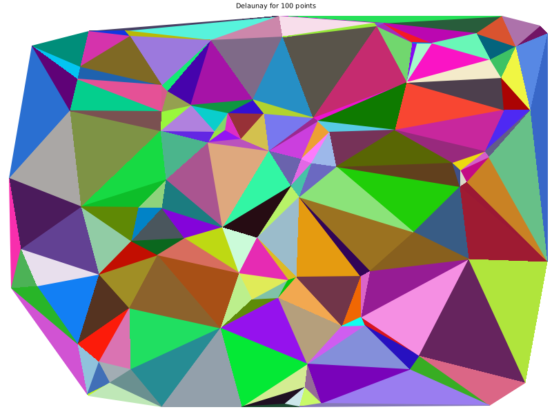
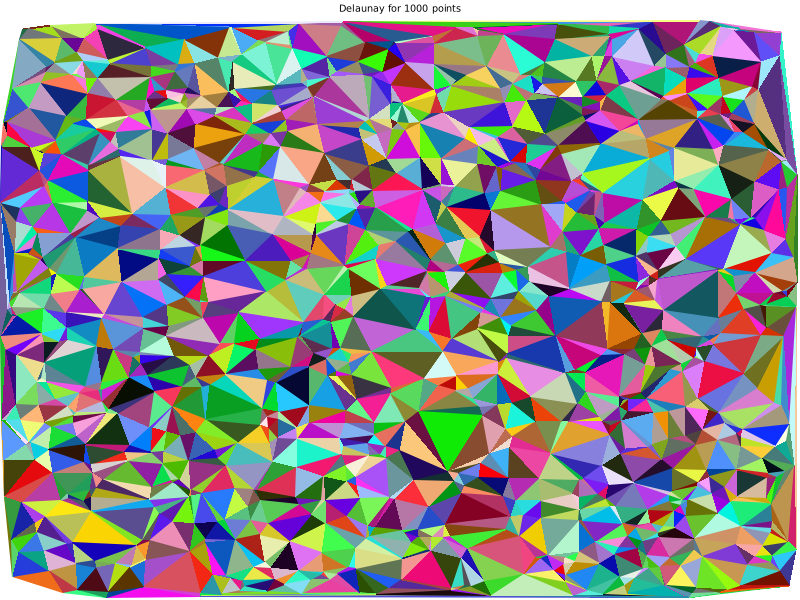
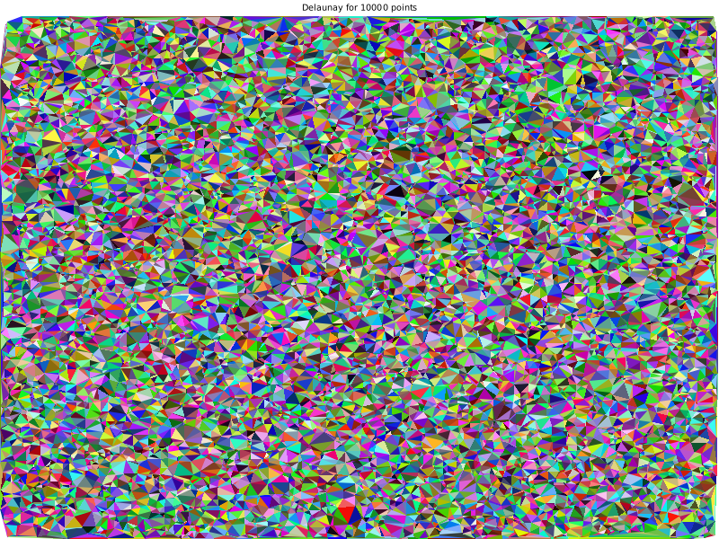
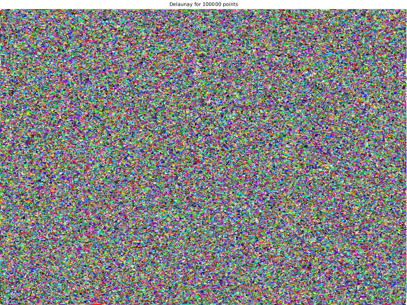
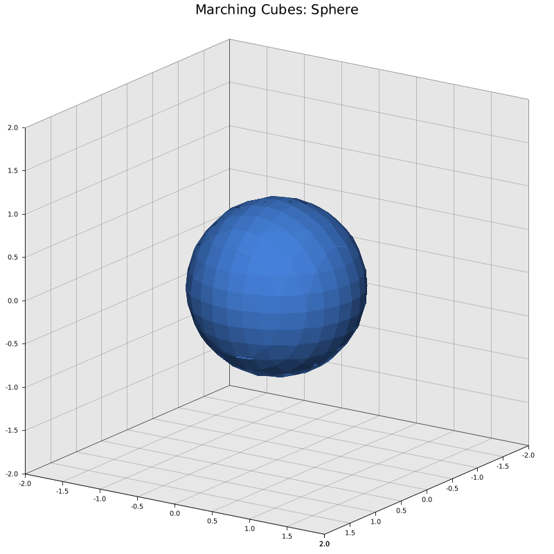
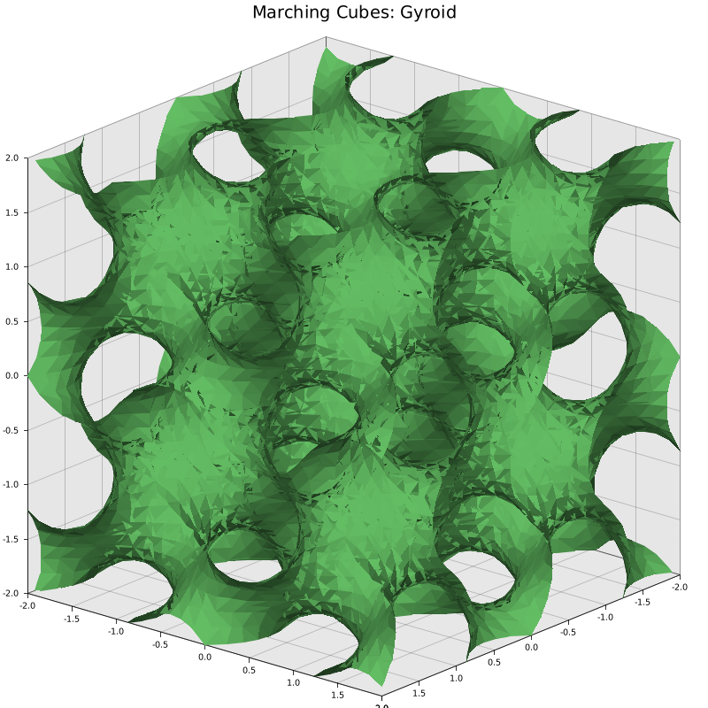
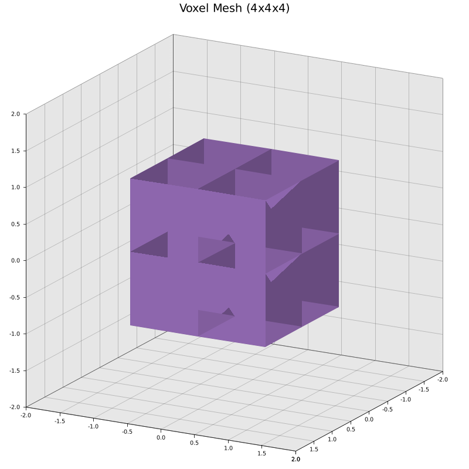
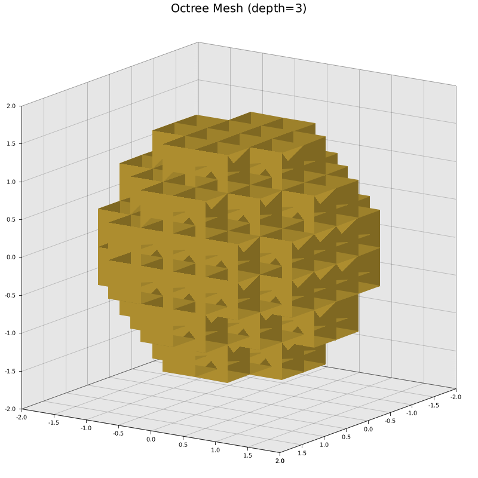

# meshing

A Rust library for 2D/3D mesh generation with multiple algorithms, export formats, and WebAssembly support.

## Features

### Mesh Generation Algorithms

| Algorithm | Module | Input | Output | Description |
|---|---|---|---|---|
| Bowyer-Watson 2D | `bowyer_watson` | `Vec<Point2D>` | `Vec<Triangle>` | Delaunay triangulation of 2D point sets |
| Bowyer-Watson 3D | `bowyer_watson_3d` | `Vec<Point3D>` | `Vec<Tetrahedron>` | Delaunay tetrahedralization of 3D point sets |
| Advancing Front | `advancing_front` | `Vec<Face>`, `Vec<Point3D>` | `Vec<Tetrahedron>` | Boundary-to-volume tetrahedral meshing |
| Octree | `octree` | Bounding box, depth, predicate | `Vec<Tetrahedron>` | Recursive spatial subdivision meshing |
| Marching Cubes | `marching_cubes` | Grid resolution, scalar field, iso-value | `Vec<Face>` | Isosurface extraction from scalar fields |
| Voxel Mesh | `voxel_mesh` | Bounding box, resolution, predicate | `Vec<Tetrahedron>` | Uniform grid volume meshing |
| Delaunay Refinement | `delaunay_refinement` | `Vec<Point3D>`, quality threshold | `Vec<Tetrahedron>` | Ruppert's algorithm for mesh quality improvement |

### Pipeline Compositions

| Function | Description |
|---|---|
| `surface_to_volume` | Marching Cubes + Advancing Front: implicit surface to volume mesh |
| `octree_refined` | Octree + Delaunay Refinement: spatial subdivision with quality improvement |
| `voxel_refined` | Voxel Mesh + Delaunay Refinement: uniform grid with quality improvement |
| `refine_tetrahedra` | Apply Delaunay Refinement to any existing tetrahedral mesh |

### Export Formats

| Format | Functions | Description |
|---|---|---|
| STL | `triangles_to_stl`, `faces_to_stl`, `tetrahedra_to_stl` | Binary STL with automatic surface extraction |
| OBJ | `triangles_to_obj`, `faces_to_obj`, `tetrahedra_to_obj` | Wavefront OBJ text format |
| VTK | `tetrahedra_to_vtk` | VTK Legacy unstructured grid (cell type 10) |
| glTF | `faces_to_gltf`, `tetrahedra_to_gltf` | glTF 2.0 JSON with embedded base64 buffers |
| GLB | `faces_to_glb`, `tetrahedra_to_glb` | glTF 2.0 binary format |
| Quantized GLB | `faces_to_glb_quantized`, `tetrahedra_to_glb_quantized` | GLB with KHR_mesh_quantization (i16 positions) |

### WebAssembly

All major algorithms are exposed as WASM bindings via `wasm-bindgen`:

- `triangulate` - 2D Bowyer-Watson
- `triangulate_3d` - 3D Bowyer-Watson
- `advancing_front_mesh` - Advancing Front
- `octree_mesh_generate` - Octree meshing
- `marching_cubes_generate` - Marching Cubes
- `voxel_mesh_generate` - Voxel meshing
- `delaunay_refinement_mesh` - Delaunay Refinement

## Quick Start

### 2D Triangulation

```rust
use meshing::{bowyer_watson, Point2D};

let points = vec![
    Point2D { index: 0, x: 0.0, y: 0.0 },
    Point2D { index: 1, x: 1.0, y: 0.0 },
    Point2D { index: 2, x: 0.0, y: 1.0 },
    Point2D { index: 3, x: 1.0, y: 1.0 },
];
let triangles = bowyer_watson(points).unwrap();
assert_eq!(triangles.len(), 2);
```

### 3D Tetrahedralization

```rust
use meshing::{bowyer_watson_3d, Point3D};

let points = vec![
    Point3D { index: 0, x: 0.0, y: 0.0, z: 0.0 },
    Point3D { index: 1, x: 1.0, y: 0.0, z: 0.0 },
    Point3D { index: 2, x: 0.5, y: 1.0, z: 0.0 },
    Point3D { index: 3, x: 0.5, y: 0.5, z: 1.0 },
];
let tetrahedra = bowyer_watson_3d(points);
assert_eq!(tetrahedra.len(), 1);
```

### Marching Cubes + Export to GLB

```rust
use meshing::marching_cubes::marching_cubes;
use meshing::export::faces_to_glb;
use meshing::Point3D;

let min = Point3D { index: 0, x: -2.0, y: -2.0, z: -2.0 };
let max = Point3D { index: 0, x: 2.0, y: 2.0, z: 2.0 };

// Sphere isosurface
let sphere = |x: f64, y: f64, z: f64| x * x + y * y + z * z - 1.0;
let faces = marching_cubes(10, 10, 10, min, max, &sphere, 0.0);
let glb_bytes = faces_to_glb(&faces);
```

### Pipeline: Implicit Surface to Volume Mesh

```rust
use meshing::pipeline::surface_to_volume;
use meshing::Point3D;

let min = Point3D { index: 0, x: -2.0, y: -2.0, z: -2.0 };
let max = Point3D { index: 0, x: 2.0, y: 2.0, z: 2.0 };

let sphere = |x: f64, y: f64, z: f64| x * x + y * y + z * z - 1.0;
let tetrahedra = surface_to_volume(8, 8, 8, min, max, &sphere, 0.0);
```

## Examples

### 2D

```
cargo run --example simple_2d_triangulation
cargo run --example 2d_plot 100
```






### 3D

```
# Bowyer-Watson 3D on cube vertices
cargo run --example simple_3d_tetrahedralization

# Marching cubes sphere → export to STL, OBJ, GLB, VTK
cargo run --example sphere_mesh_export

# All pipeline algorithms (marching cubes, surface_to_volume, octree_refined, voxel_refined)
cargo run --example pipeline_example

# Generate 3D visualization PNGs (requires --release for font rendering)
cargo run --release --example 3d_plot
```

| Marching Cubes: Sphere | Marching Cubes: Torus | Marching Cubes: Gyroid |
|---|---|---|
|  |  |  |

| Voxel Mesh | Octree Mesh |
|---|---|
|  |  |

Output files (STL, OBJ, GLB, VTK) are written to `examples/` and can be viewed with:
- **STL/OBJ/GLB** - MeshLab, Blender, [glTF Viewer](https://gltf-viewer.donmccurdy.com/)
- **VTK** - ParaView

## Benchmarks

```
cargo bench
```

Benchmarks cover all algorithms at various input sizes using Criterion.

## License

See [LICENSE](LICENSE).
